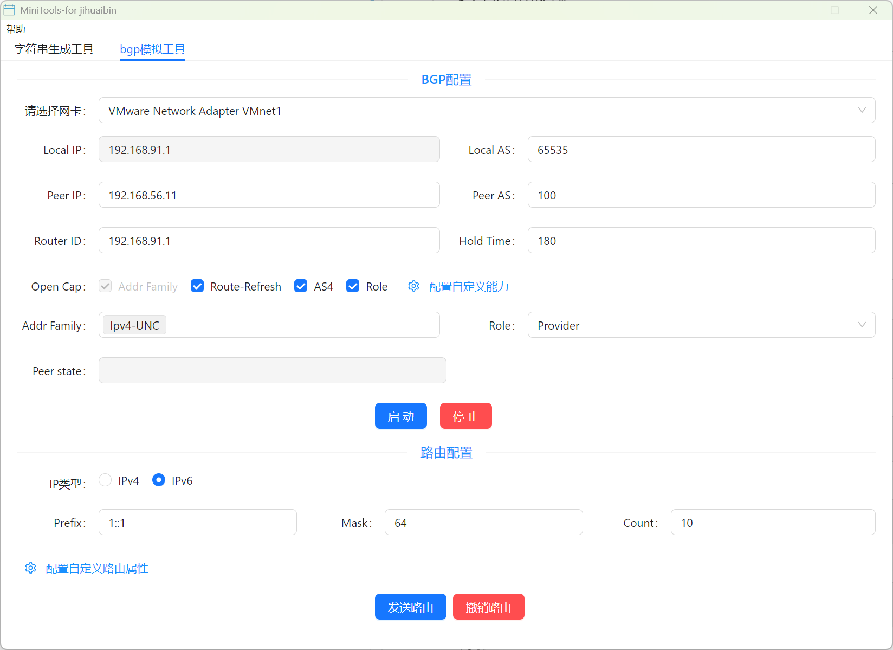
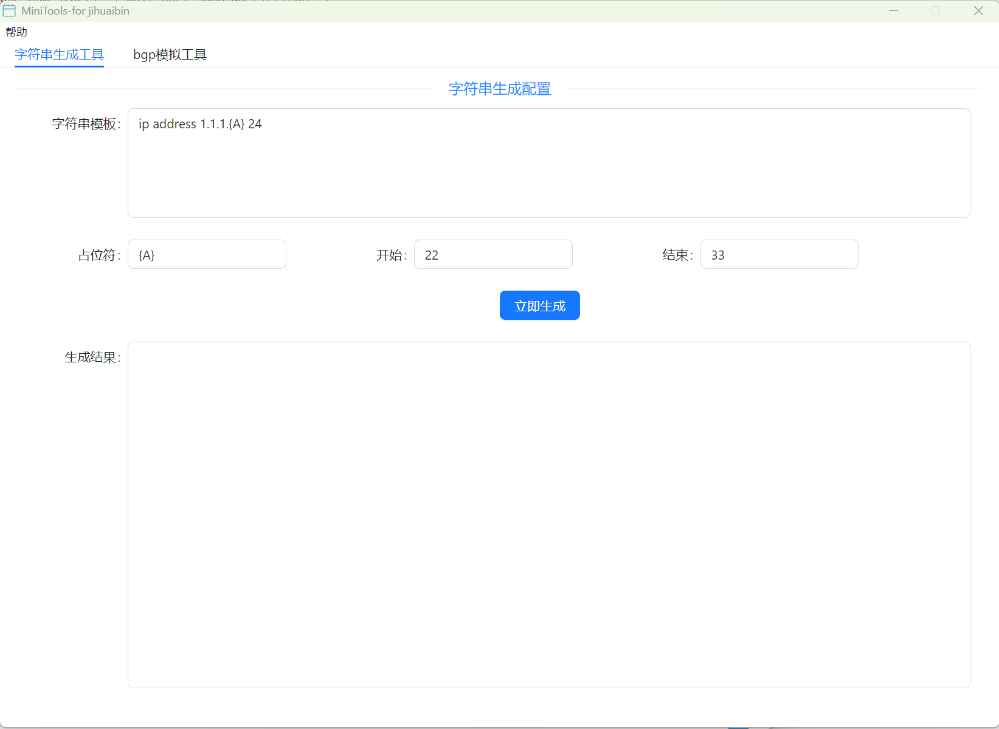

# Mini-Tools

一个基于 Vue3 + Ant Design Vue + Electron 开发的网络和开发辅助工具集。

## 功能特性

### BGP 模拟器
- 模拟 BGP 协议行为和路由传播
- 支持多 BGP 对等体配置
- 可视化 BGP 路由信息
- 支持路由策略配置



### 字符串生成器
- 生成多种格式的字符串
- 支持正则表达式模式
- 支持批量生成和自定义设置
- 快速复制和导出功能



### 未来计划
- JSON 解析与格式化工具
- 网络连接测试工具
- 编码/解码转换工具
- 更多网络协议模拟器

## 技术栈

- **前端框架**: Vue 3 + Composition API
- **UI 组件库**: Ant Design Vue 3.x
- **桌面应用**: Electron 22+
- **构建工具**: Vite
- **状态管理**: Vuex 4
- **路由**: Vue Router 4

## 开发环境要求

- Node.js 16.x 或更高版本
- npm 8.x 或更高版本
- 支持的操作系统: Windows 10+, macOS 11+, Linux

## 安装与运行

1. 克隆项目

```bash
git clone https://github.com/jihuaib/mini-tools.git
cd mini-tools
```

2. 安装依赖

```bash
npm install
```

3. 开发模式运行

```bash
# 启动 Vue 开发服务器
npm run dev

# 启动 Electron 开发环境
npm run electron:dev
```

4. 打包应用

```bash
# 打包所有平台
npm run dist

# 仅打包 Windows 版本
npm run dist:win

# 仅打包 macOS 版本
npm run dist:mac

# 仅打包 Linux 版本
npm run dist:linux
```

## 使用指南

### BGP 模拟器
1. 在主界面选择 "BGP 模拟器"
2. 添加 BGP 对等体并配置 AS 号、IP 地址等信息
3. 设置路由策略和路由通告
4. 启动模拟，观察路由传播过程

### 字符串生成器
1. 在主界面选择 "字符串生成器"
2. 选择所需的字符串格式或输入自定义正则表达式
3. 设置生成数量和其他参数
4. 点击生成按钮获取结果
5. 使用复制或导出功能保存结果

## 项目结构

```
mini-tools/
├── electron/          # Electron 主进程代码
│   ├── main.js        # 主进程入口
│   └── preload.js     # 预加载脚本
├── src/               # Vue 应用源代码
│   ├── assets/        # 静态资源
│   ├── components/    # 公共组件
│   ├── const/         # 常量定义
│   ├── router/        # 路由配置
│   ├── store/         # Vuex 状态管理
│   ├── utils/         # 工具函数
│   ├── view/          # 视图组件
│   │   ├── bgp/       # BGP 模拟器相关视图
│   │   ├── bmp/       # BMP 相关功能视图
│   │   └── tools/     # 通用工具视图
│   ├── App.vue        # 应用根组件
│   └── main.js        # 渲染进程入口
├── dist/              # 构建输出目录
├── doc/               # 文档和素材
│   └── images/        # 截图和示意图
├── index.html         # HTML 入口
├── vite.config.js     # Vite 配置
└── package.json       # 项目配置和依赖
```

## 贡献指南

1. Fork 本仓库并创建您的分支
2. 安装开发依赖并进行本地测试
3. 提交更改并创建 Pull Request
4. 在 PR 中详细描述您的更改

### 代码风格
- 遵循项目的 ESLint 和 Prettier 配置
- 组件使用 Vue 3 Composition API
- 保持代码简洁和可读性

## 常见问题

- **Q: 如何添加新工具?**
  A: 在 `src/view/tools` 中创建新的工具组件，并在路由配置中添加入口。

- **Q: 打包后应用无法启动怎么办?**
  A: 检查日志文件，确保所有依赖正确安装，并尝试重新运行 `npm install` 后再次打包。

## 许可证

MIT License
