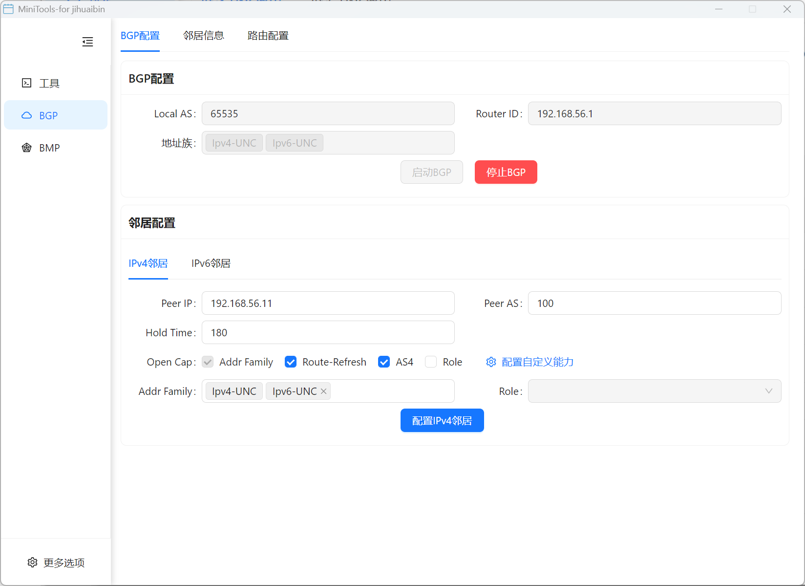
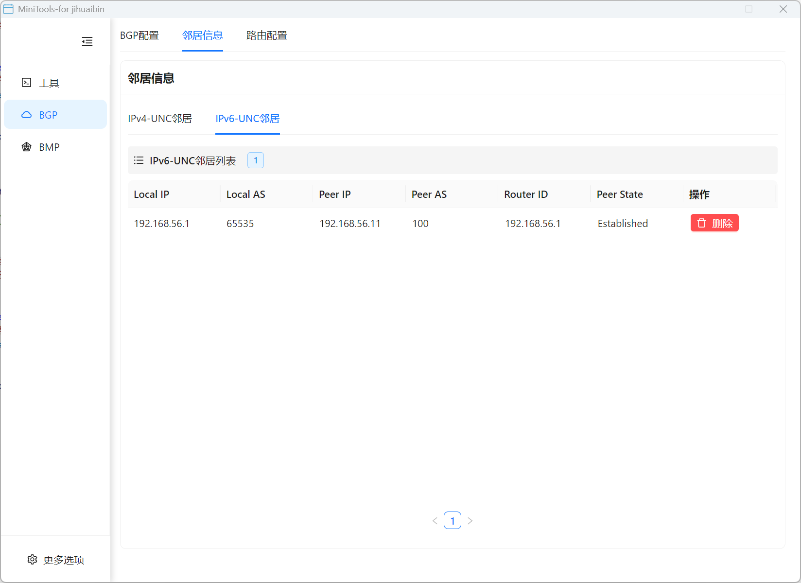
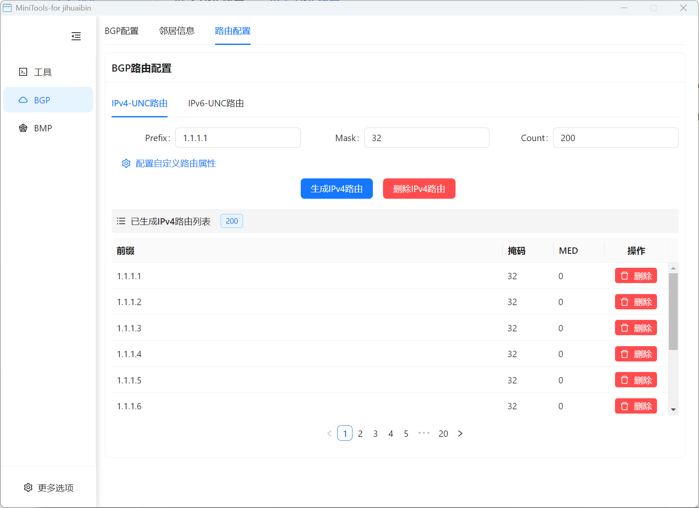
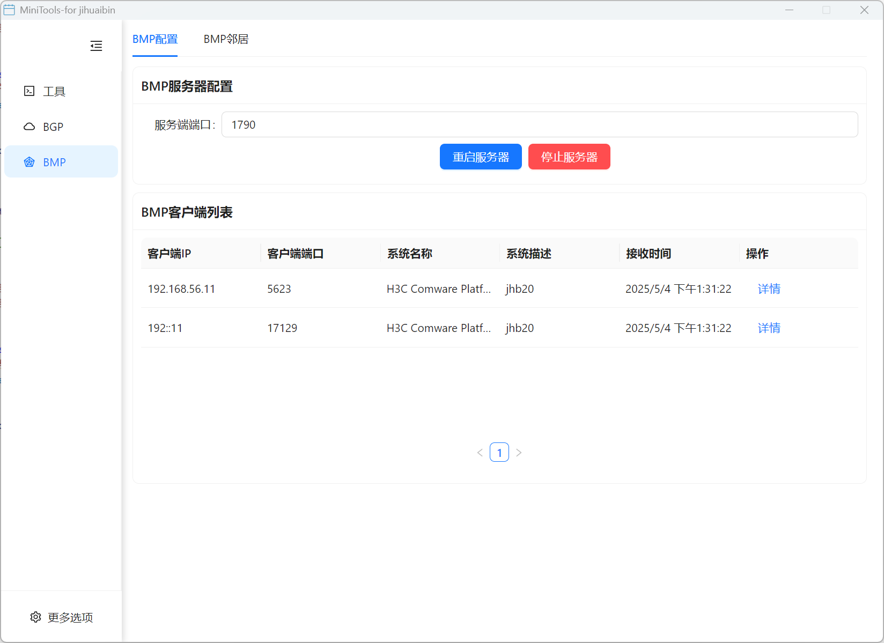
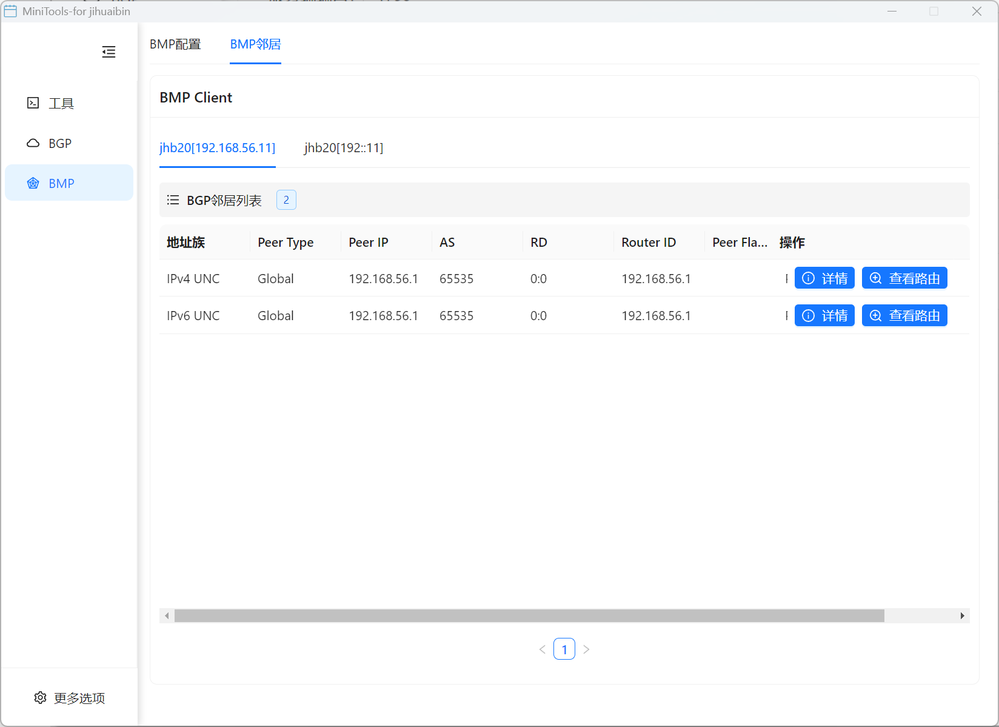
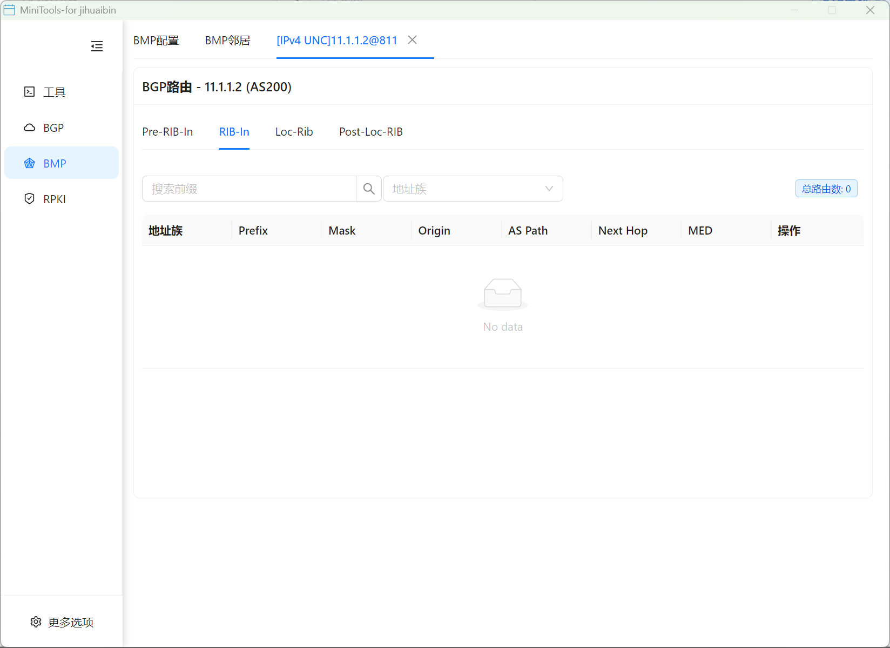
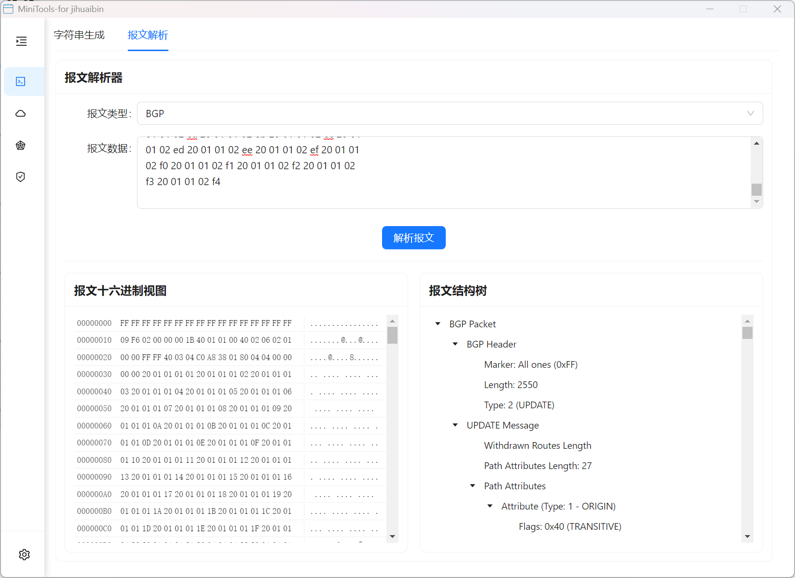
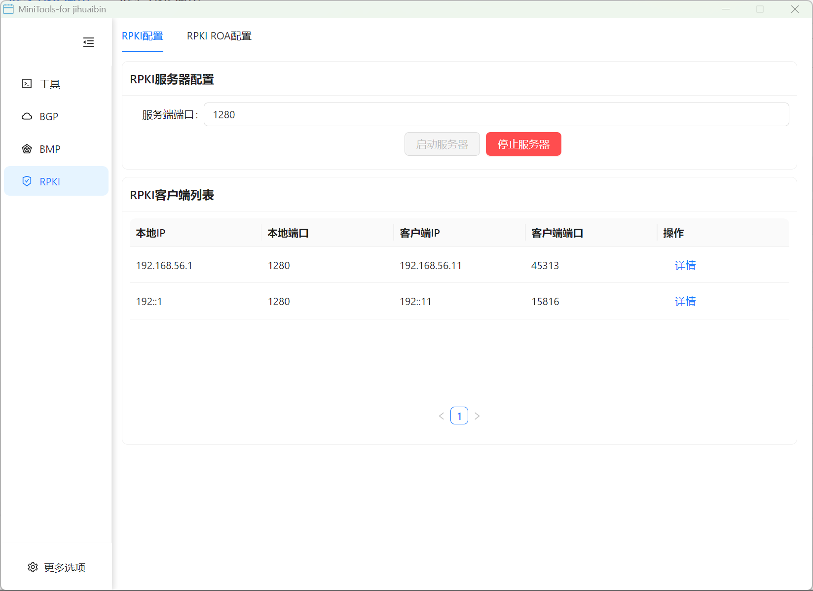
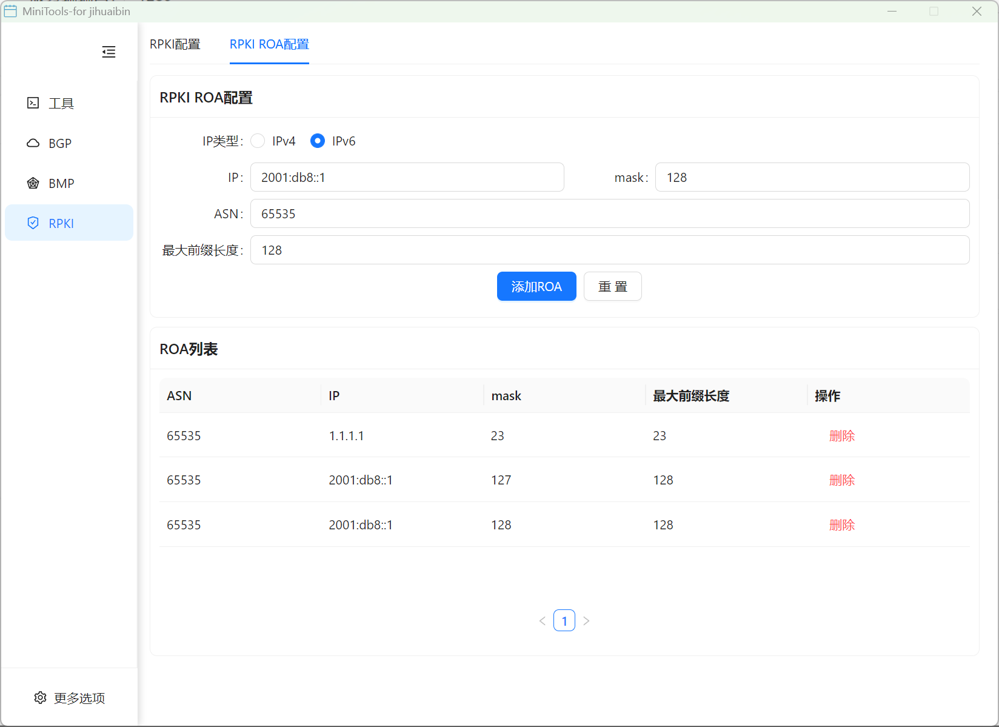
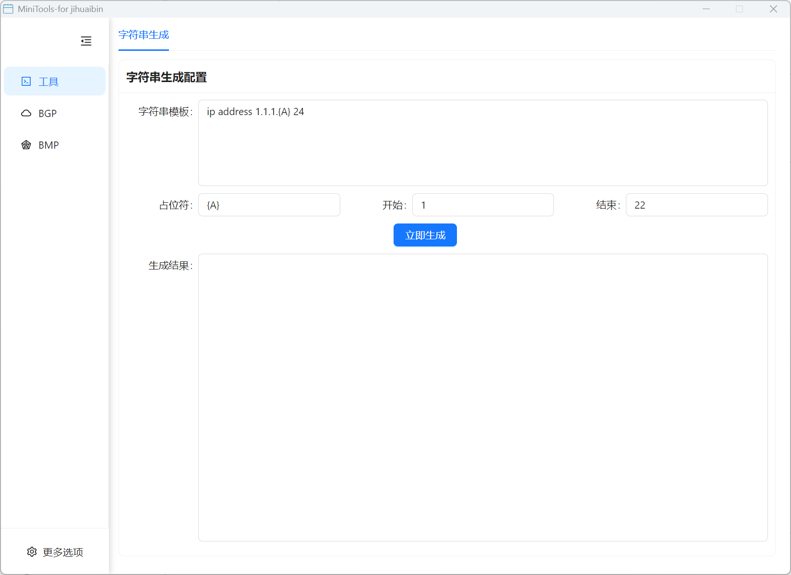

# Mini-Tools

[](https://vuejs.org/)
[](https://electronjs.org/)
[](https://antdv.com/)
[](https://opensource.org/licenses/MIT)
[](https://github.com/jihuaib/mini-tools/stargazers)
[](https://github.com/jihuaib/mini-tools/issues)

**MiniTools** - 一个基于 **Vue3** + **Ant Design Vue** + **Electron** 开发的专业**网络和开发辅助工具集**。

> 🚀 **专业的网络协议工具** | 🛠️ **开发者必备工具** | 🌐 **BGP/BMP/RPKI 全方位支持** | 📦 **跨平台桌面应用**

## 🏷️ 标签关键词

`Vue3` `Electron` `网络工具` `BGP模拟器` `BMP监控器` `RPKI验证器` `报文解析器` `字符串生成器` `网络协议` `路由器工具` `开发工具` `桌面应用` `跨平台` `网络开发` `协议分析` `网络运维` `BGP` `BMP` `RPKI` `Router` `Network Tools` `Developer Tools`

## 功能特性

### BGP 模拟器

- 模拟 BGP 协议行为和路由传播
- 支持多 BGP 对等体配置
- 可视化 BGP 路由信息
- 支持路由策略配置





### BMP 监控器

- 支持 BGP 监控协议(BMP)配置
- 监控和显示 BMP 对等体信息
- 实时查看 BMP 对等体路由信息
- 详细的路由属性展示





### 报文解析器

- 支持多种网络协议报文格式解析
- 可视化展示报文字段和结构
- 详细解析报文内容和属性
- 支持常见协议格式



### RPKI 验证器

- 支持 RPKI 路由源验证
- 配置和管理 ROA 记录
- 实时验证路由的有效性
- 与 BGP 路由信息集成




### 字符串生成器

- 生成多种格式的字符串
- 支持正则表达式模式
- 支持批量生成和自定义设置
- 快速复制和导出功能



### 未来计划

- JSON 解析与格式化工具
- 网络连接测试工具
- 编码/解码转换工具
- IP 地址计算工具
- DNS 查询与解析工具
- SSL 证书检查工具
- 更多网络协议模拟器

## 技术栈

- **前端框架**: Vue 3 + Composition API
- **UI 组件库**: Ant Design Vue 4.x
- **桌面应用**: Electron 15+
- **构建工具**: Vite
- **状态管理**: Vuex 4
- **路由**: Vue Router 4

## 开发环境要求

- Node.js 16.20.2 或更高版本
- npm 8.19.4 或更高版本
- 支持的操作系统: Windows 7+, macOS 11+, Linux

## 安装与运行

1. 克隆项目

```bash
git clone https://github.com/jihuaib/mini-tools.git
cd mini-tools
```

2. 安装依赖

```bash
npm install
```

3. 开发模式运行

```bash
# 启动开发环境
npm run dev
```

4. 打包应用

```bash
# 打包应用
npm run dist

# 打包并发布
npm run release
```

## 使用指南

### BGP 模拟器

1. 在主界面选择 "BGP 模拟器"
2. 在 BGP 配置页面添加 BGP 对等体并配置 AS 号、IP 地址等信息
3. 通过路由配置页面设置路由策略和路由通告
4. 在 BGP 对等体信息页面查看路由传播状态

### BMP 监控器

1. 在主界面选择 "BMP 监控器"
2. 在 BMP 配置页面设置监听地址和端口
3. 在 BMP 对等体页面查看连接的 BMP 客户端和对等体信息
4. 点击对等体查看详细的路由信息

### RPKI 验证器

1. 在主界面选择 "RPKI 验证器"
2. 在 RPKI 配置页面设置验证参数
3. 添加和管理 ROA 记录
4. 查看验证结果和与 BGP 路由的集成信息

### 报文解析器

1. 在主界面选择 "报文解析器"
2. 导入网络报文数据或手动输入报文内容
3. 选择协议类型进行解析
4. 查看解析后的报文结构和详细字段说明

### 字符串生成器

1. 在主界面选择 "工具" 下的 "字符串生成器"
2. 选择所需的字符串格式或输入自定义正则表达式
3. 设置生成数量和其他参数
4. 点击生成按钮获取结果
5. 使用复制功能保存结果

## 项目结构

```
mini-tools/
├── electron/          # Electron 主进程代码
│   ├── main.js        # 主进程入口
│   └── preload.js     # 预加载脚本
├── src/               # Vue 应用源代码
│   ├── assets/        # 静态资源
│   ├── components/    # 公共组件
│   ├── const/         # 常量定义
│   ├── router/        # 路由配置
│   ├── store/         # Vuex 状态管理
│   ├── utils/         # 工具函数
│   ├── view/          # 视图组件
│   │   ├── bgp/       # BGP 模拟器相关视图
│   │   ├── bmp/       # BMP 监控器相关视图
│   │   ├── rpki/      # RPKI 验证器相关视图
│   │   ├── parser/    # 报文解析器相关视图
│   │   └── tools/     # 通用工具视图
│   ├── App.vue        # 应用根组件
│   └── main.js        # 渲染进程入口
├── dist/              # 构建输出目录
├── doc/               # 文档和素材
│   └── images/        # 截图和示意图
├── index.html         # HTML 入口
├── vite.config.js     # Vite 配置
└── package.json       # 项目配置和依赖
```

## 贡献指南

1. Fork 本仓库并创建您的分支
2. 安装开发依赖并进行本地测试
3. 提交更改并创建 Pull Request
4. 在 PR 中详细描述您的更改

### 代码风格

- 遵循项目的 ESLint 和 Prettier 配置
- 组件使用 Vue 3 Composition API
- 保持代码简洁和可读性

## 常见问题

- **Q: 如何添加新工具?**
  A: 在 `src/view/tools` 中创建新的工具组件，并在路由配置中添加入口。

- **Q: 打包后应用无法启动怎么办?**
  A: 检查日志文件，确保所有依赖正确安装，并尝试重新运行 `npm install` 后再次打包。

## 相关项目和资源

### 🔗 相关链接

- [Vue.js 官方文档](https://vuejs.org/)
- [Electron 官方文档](https://electronjs.org/)
- [Ant Design Vue 组件库](https://antdv.com/)
- [BGP 协议规范](https://tools.ietf.org/html/rfc4271)
- [BMP 协议规范](https://tools.ietf.org/html/rfc7854)
- [RPKI 相关规范](https://tools.ietf.org/html/rfc6480)

### 📋 更新日志

查看 [Releases](https://github.com/jihuaib/mini-tools/releases) 页面了解最新版本更新内容。

### 🤝 贡献者

感谢所有为项目贡献代码的开发者！

### 📝 开发计划

- [ ] 添加更多网络协议支持
- [ ] 增强用户界面和用户体验
- [ ] 添加自动化测试
- [ ] 支持插件系统
- [ ] 添加数据导入导出功能

## 🏷️ 项目标签

**技术栈**: `Vue3` `Electron` `JavaScript` `Ant-Design-Vue` `Vite` `Node.js`

**应用领域**: `网络工程` `系统管理` `协议分析` `网络运维` `开发工具` `网络安全`

**支持协议**: `BGP` `BMP` `RPKI` `TCP/IP` `网络报文分析`

**目标用户**: `网络工程师` `系统管理员` `网络开发者` `学生` `研究人员` `运维人员`

## License

MIT © 2025 huaibin ji

---

⭐ 如果这个项目对你有帮助，请给我们一个 Star！

🐛 发现问题？[提交 Issue](https://github.com/jihuaib/mini-tools/issues/new/choose)

💡 有新想法？[提交功能请求](https://github.com/jihuaib/mini-tools/issues/new/choose)

🚀 想要贡献代码？[查看贡献指南](#贡献指南)
