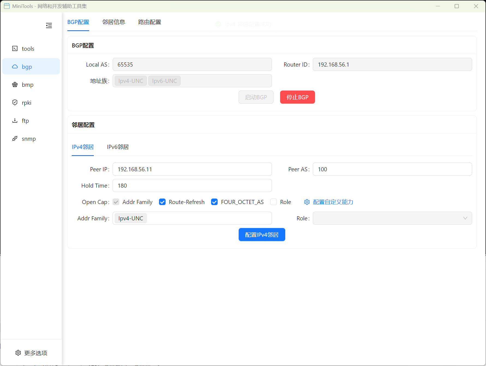
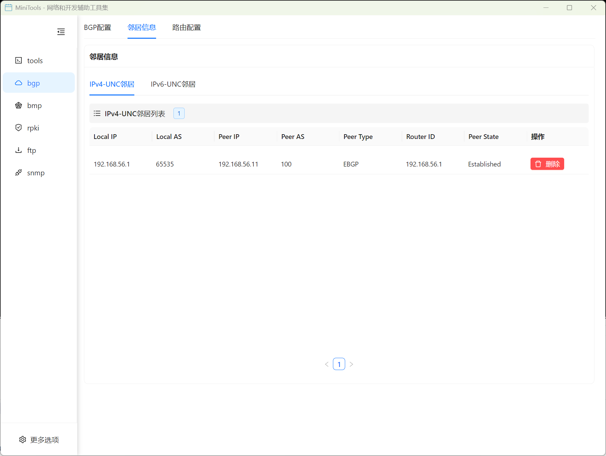
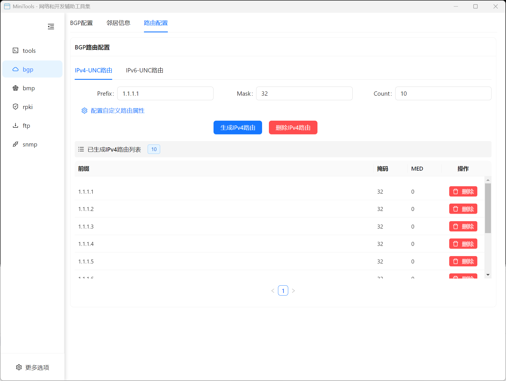
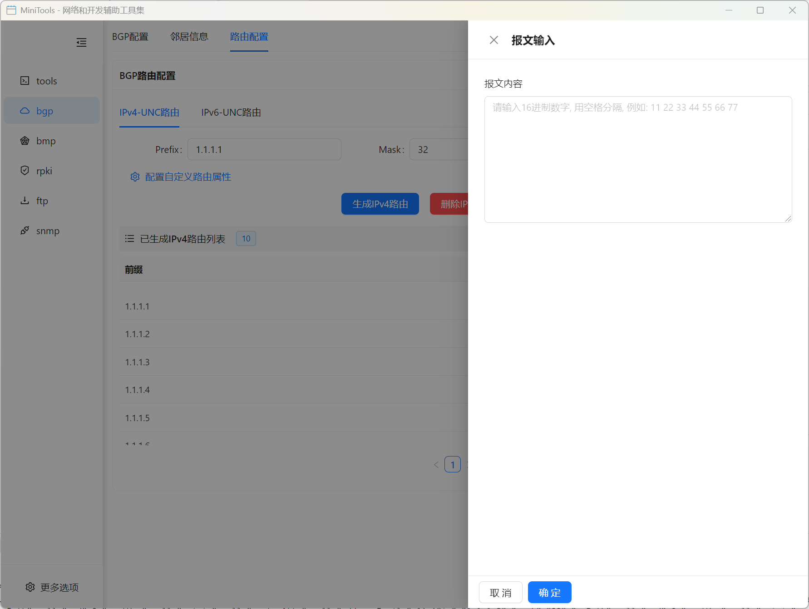

# BGP 模拟器

BGP 模拟器是一个强大的 BGP 协议模拟工具，支持完整的 BGP 会话管理和路由传播模拟。

## 功能特性

### 核心功能
- 🔄 **多对等体支持**: 支持同时配置和管理多个 BGP 对等体
- 🌐 **路由传播模拟**: 完整模拟 BGP 路由通告和接收过程
- 📊 **可视化监控**: 实时显示 BGP 会话状态和路由信息
- ⚙️ **灵活配置**: 支持丰富的 BGP 配置选项和策略设置
- 🔍 **详细分析**: 提供路由属性的详细展示和分析

### BGP 配置管理
- AS 号码配置
- Router ID 设置
- 对等体 IP 地址和端口配置
- BGP 会话参数设置
- Keepalive 和 Hold Timer 配置

### 对等体信息监控
- 实时显示 BGP 对等体连接状态
- 会话建立过程监控
- 消息统计和错误计数
- 对等体能力协商信息

### 路由管理功能

#### IPv4 路由管理
- IPv4 单播路由生成和管理
- 支持批量路由生成
- 路由前缀和掩码配置
- 路由属性自定义 (AS Path, Next Hop, Origin, MED, Local Pref, Communities)
- 从 RouteViews 导入真实路由数据
- 单条路由删除和批量删除
- 路由列表分页显示

#### IPv6 路由管理
- IPv6 单播路由生成和管理
- 支持批量路由生成
- 路由前缀和前缀长度配置
- 路由属性自定义
- 从 RouteViews 导入 IPv6 路由数据
- 路由增删改查功能

#### MVPN 路由管理
- MVPN (Multicast VPN) 路由支持
- VPN 路由目标 (RT) 配置
- 组播源和组地址配置
- MVPN 路由属性自定义
- 批量路由生成和管理

### 高级功能

#### Open 消息自定义属性
支持在 BGP Open 消息中添加自定义属性，用于扩展协议功能和测试特殊场景。

#### 路由自定义属性
允许为 BGP 路由添加自定义属性，支持各种路由策略和过滤规则的测试。

## 使用指南

### 基本配置步骤

1. **启动 BGP 模拟器**
   - 在主界面选择 "BGP 模拟器"
   - 进入 BGP 配置界面

2. **配置 BGP 参数**
   - 设置本地 AS 号码
   - 配置 Router ID
   - 设置监听地址和端口

3. **添加 BGP 对等体**
   - 点击添加对等体按钮
   - 配置对等体 AS 号码
   - 设置对等体 IP 地址和端口
   - 配置会话参数

4. **启动 BGP 会话**
   - 保存配置并启动服务
   - 监控对等体连接状态
   - 查看会话建立过程

### 路由配置

#### IPv4 路由配置
1. **基本配置**
   - 设置路由前缀 (如: 192.168.0.0)
   - 设置子网掩码 (如: 24)
   - 设置生成数量 (批量生成路由)
   - 配置 RT (Route Target) 可选

2. **自定义路由属性**
   - 点击"配置自定义路由属性"按钮
   - 设置 AS Path、Origin、Next Hop
   - 配置 MED、Local Preference
   - 添加 Communities 属性

3. **RouteViews 导入**
   - 点击"从 RouteViews 导入"按钮
   - 从真实的互联网路由数据中导入
   - 支持过滤和筛选

4. **路由管理**
   - 查看已生成的路由列表
   - 单条路由删除
   - 批量删除所有路由
   - 分页浏览路由

#### IPv6 路由配置
1. **基本配置**
   - 设置 IPv6 路由前缀 (如: 2001:db8::)
   - 设置前缀长度 (如: 64)
   - 设置生成数量
   - 配置 RT (可选)

2. **路由属性和管理**
   - 支持与 IPv4 相同的自定义属性
   - 支持从 RouteViews 导入 IPv6 路由
   - 完整的增删改查功能

#### MVPN 路由配置
1. **MVPN 特定配置**
   - 配置组播源地址
   - 配置组播组地址
   - 设置 VPN Route Target
   - 配置 MVPN 路由属性

2. **动态路由学习**
   - 接收对等体通告的路由
   - 查看路由选择过程
   - 分析最佳路径选择

### 监控和调试

1. **实时监控**
   - 查看 BGP 会话状态
   - 监控消息交换
   - 观察路由变化

2. **日志分析**
   - 查看详细的 BGP 消息日志
   - 分析协议交互过程
   - 诊断连接问题

## 技术规范

### 支持的 BGP 功能
- BGP-4 基本协议 (RFC 4271)
- Multi-protocol Extensions (RFC 4760)
- Route Refresh (RFC 2918)
- Graceful Restart (RFC 4724)

### 支持的地址族
- IPv4 Unicast
- IPv6 Unicast
- IPv4/IPv6 Multicast
- VPNv4/VPNv6

### 路由属性支持
- ORIGIN
- AS_PATH
- NEXT_HOP
- MULTI_EXIT_DISC
- LOCAL_PREF
- ATOMIC_AGGREGATE
- AGGREGATOR
- COMMUNITY
- EXTENDED_COMMUNITY

## 应用场景

### 网络测试
- BGP 协议功能测试
- 路由策略验证
- 故障场景模拟
- 性能测试

### 学习研究
- BGP 协议学习
- 路由行为分析
- 网络设计验证
- 协议扩展研究

### 开发调试
- BGP 应用开发
- 协议实现测试
- 互操作性验证
- 新功能验证

## 常见问题

**Q: 如何配置多个 BGP 对等体？**
A: 在 BGP 配置界面点击"添加对等体"按钮，为每个对等体分别配置 AS 号码和连接参数。

**Q: BGP 会话无法建立怎么办？**
A: 检查网络连通性、AS 号码配置、认证设置等，查看日志获取详细错误信息。

**Q: 如何查看路由的详细属性？**
A: 在路由信息页面点击具体路由条目，可以查看完整的路由属性信息。

**Q: 支持哪些 BGP 消息类型？**
A: 支持完整的 BGP 消息类型：Open、Update、Notification、Keepalive 和 Route Refresh。
