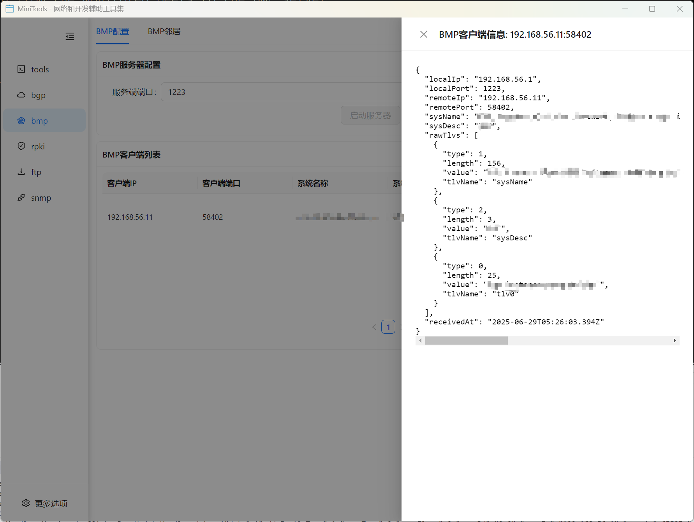
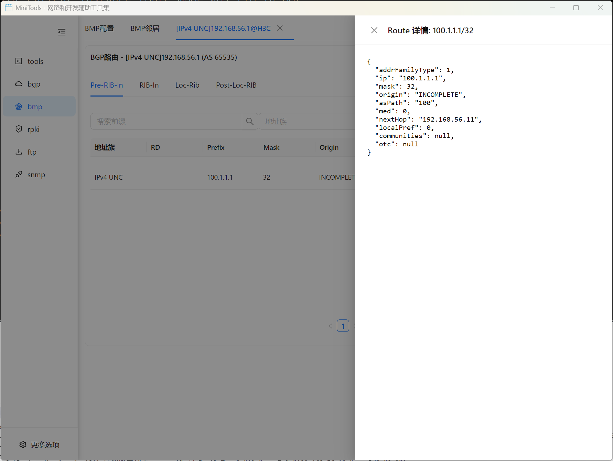

# BMP 监控器

BMP (BGP Monitoring Protocol) 监控器是一个专业的 BGP 路由监控工具，支持实时监控和分析 BGP 路由信息。

## 功能特性

### 核心功能
- 📡 **实时监控**: 实时接收和处理 BMP 消息
- 🔍 **路由分析**: 深度分析 BGP 路由变化和传播
- 📊 **数据可视化**: 图形化展示路由信息和统计数据
- 🌐 **多客户端支持**: 同时监控多个 BMP 客户端
- 📈 **统计报告**: 提供详细的路由统计和趋势分析

### BMP 配置和客户端信息
- BMP 服务器配置
- 监听地址和端口设置
- 客户端连接管理
- 消息类型配置
- 数据存储设置

### 客户端和 BGP 监控对等体信息
- 实时显示 BMP 客户端连接状态
- BGP 监控对等体详细信息
- 会话建立时间和统计信息
- 对等体能力和配置信息
- 连接质量监控

### BGP 路由监控
- 实时路由表更新监控
- 路由变化历史记录
- 路由属性详细分析
- AS Path 变化追踪
- 路由收敛时间分析

### 统计报告功能
BMP 监控器提供强大的统计分析和报告功能,帮助用户深入了解 BGP 路由状态和变化趋势。

#### BGP 会话统计报告
- 实时 BGP 会话统计信息
- 会话建立和断开历史
- 消息收发统计
- 会话状态变化趋势
- 对等体连接质量分析
- 可视化图表展示

#### Loc-RIB 统计报告
- 本地路由信息库统计
- 路由数量统计和趋势
- 路由变化频率分析
- 不同地址族路由分布
- 路由属性统计
- 历史数据对比分析

## 使用指南

### 基本配置步骤

1. **启动 BMP 监控器**
   - 在主界面选择 "BMP 监控器"
   - 进入 BMP 配置界面

2. **配置 BMP 服务器**
   - 设置监听地址和端口
   - 配置消息过滤规则
   - 设置数据存储选项

3. **连接 BMP 客户端**
   - 启动 BMP 服务器
   - 等待客户端连接
   - 验证连接状态

4. **监控 BGP 路由**
   - 查看实时路由更新
   - 分析路由变化趋势
   - 导出监控数据

### 高级功能

#### 路由过滤和分析
- 支持基于前缀、AS Path、Community 等的路由过滤
- 提供路由聚合和统计分析
- 支持历史数据查询和比较

#### 告警和通知
- 路由异常变化告警
- 对等体状态变化通知
- 自定义告警规则设置

#### 数据导出
- 支持多种格式的数据导出
- 定期报告生成
- API 接口支持

## 技术规范

### 支持的 BMP 版本
- BMP Version 3 (RFC 7854)
- BMP Version 4 (Draft)

### 支持的消息类型
- Route Monitoring
- Statistics Report
- Peer Down Notification
- Peer Up Notification
- Initiation Message
- Termination Message

### 支持的 BGP 地址族
- IPv4 Unicast
- IPv6 Unicast
- IPv4/IPv6 Multicast
- VPNv4/VPNv6
- L2VPN EVPN

## 应用场景

### 网络运维
- BGP 路由监控
- 网络故障诊断
- 路由安全分析
- 性能优化

### 网络研究
- 路由行为分析
- 网络拓扑研究
- 协议性能评估
- 数据挖掘分析

### 合规监管
- 路由合规检查
- 安全策略验证
- 审计日志记录
- 报告生成

## 常见问题

**Q: BMP 客户端无法连接怎么办？**
A: 检查网络连通性、防火墙设置、BMP 服务器配置等，确保端口正确开放。

**Q: 如何过滤特定的路由信息？**
A: 在配置界面设置过滤规则，可以基于前缀、AS 号码、Community 等进行过滤。

**Q: 监控数据如何导出？**
A: 在数据展示界面点击导出按钮，选择导出格式和时间范围。

**Q: 支持多少个并发客户端连接？**
A: 理论上支持无限制的客户端连接，实际限制取决于系统资源。
