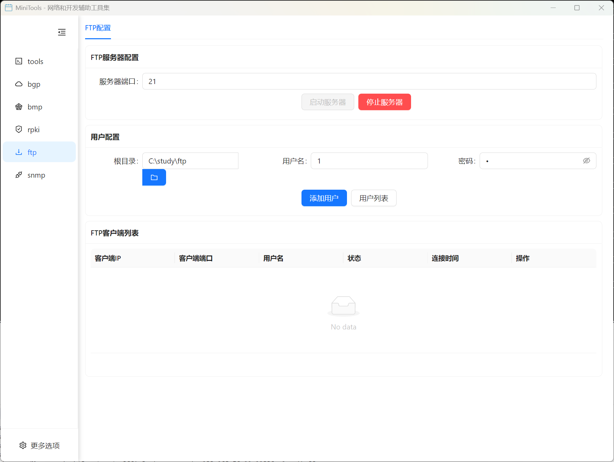

# FTP 服务器

内置的 FTP 服务器提供完整的文件传输服务，支持多用户管理和权限控制。

## 功能特性

### 核心功能
- 📁 **完整 FTP 服务**: 支持标准 FTP 协议的所有功能
- 👥 **多用户管理**: 支持多个用户账户的创建和管理
- 🔐 **权限控制**: 灵活的用户权限和目录访问控制
- 📊 **实时监控**: 实时显示连接状态和传输统计
- 🔄 **传输管理**: 支持断点续传和并发传输

### FTP 配置和客户端
- FTP 服务器基本配置
- 监听地址和端口设置
- 服务器模式配置（主动/被动）
- 客户端连接管理
- 数据传输配置

### 用户管理
- 用户账户的创建和删除
- 密码设置和管理
- 用户权限配置
- 主目录设置
- 访问控制列表

## 使用指南

### 服务器配置

1. **基本配置**
   - 设置服务器监听地址和端口
   - 选择 FTP 服务器模式（主动/被动）
   - 配置最大连接数限制
   - 设置传输速度限制

2. **安全配置**
   - 启用/禁用匿名访问
   - 配置 SSL/TLS 加密
   - 设置访问控制规则
   - 配置日志记录

3. **高级配置**
   - 设置被动模式端口范围
   - 配置防火墙穿透
   - 设置超时参数
   - 配置字符编码

### 用户管理

1. **创建用户**
   - 设置用户名和密码
   - 指定用户主目录
   - 配置用户权限
   - 设置磁盘配额

2. **权限设置**
   - 读取权限：允许下载文件
   - 写入权限：允许上传文件
   - 删除权限：允许删除文件
   - 创建权限：允许创建目录

3. **目录管理**
   - 设置访问目录
   - 配置目录权限
   - 设置目录配额
   - 虚拟目录映射

### 客户端连接

1. **连接设置**
   - 配置 FTP 客户端连接参数
   - 选择传输模式
   - 设置编码格式
   - 配置代理设置

2. **文件操作**
   - 文件上传和下载
   - 目录浏览和创建
   - 文件重命名和删除
   - 权限查看和修改

## 技术规范

### 支持的 FTP 功能
- RFC 959: File Transfer Protocol (FTP)
- RFC 2228: FTP Security Extensions
- RFC 2428: Extensions for IPv6
- RFC 3659: Extensions to FTP

### 支持的命令
- 基本命令：USER, PASS, CWD, PWD, LIST, RETR, STOR
- 扩展命令：SIZE, MDTM, MLSD, MLST, FEAT
- 安全命令：AUTH, PBSZ, PROT

### 传输模式
- 主动模式（PORT）
- 被动模式（PASV）
- 扩展被动模式（EPSV）

### 数据类型
- ASCII 模式
- Binary 模式
- 自动检测模式

## 安全特性

### 认证机制
- 用户名/密码认证
- 匿名访问控制
- IP 地址白名单/黑名单
- 会话管理

### 加密支持
- SSL/TLS 隐式加密
- SSL/TLS 显式加密
- 数据传输加密
- 控制连接加密

### 访问控制
- 基于 IP 地址的访问控制
- 基于时间的访问控制
- 并发连接数限制
- 传输速度限制

## 监控和日志

### 实时监控
- 在线用户列表
- 传输进度监控
- 服务器状态统计
- 性能指标显示

### 日志管理
- 连接日志记录
- 传输日志记录
- 错误日志记录
- 安全事件日志

### 统计报告
- 用户活动统计
- 传输量统计
- 性能统计报告
- 历史数据分析

## 应用场景

### 文件共享
- 团队文件共享
- 项目文件管理
- 备份文件传输
- 远程文件访问

### 系统集成
- 自动化文件传输
- 系统间数据交换
- 批处理文件操作
- API 集成支持

### 开发测试
- 测试环境文件部署
- 开发资源共享
- 版本文件管理
- 临时文件传输

## 性能优化

### 传输优化
- 多线程并发传输
- 传输缓冲区优化
- 网络参数调优
- 断点续传支持

### 服务器优化
- 连接池管理
- 内存使用优化
- 磁盘 I/O 优化
- CPU 使用优化

## 常见问题

**Q: 如何设置被动模式的端口范围？**
A: 在服务器配置中设置 PASV 端口范围，确保防火墙开放相应端口。

**Q: 用户无法连接到 FTP 服务器怎么办？**
A: 检查网络连通性、防火墙设置、用户权限和服务器配置。

**Q: 如何启用 SSL/TLS 加密？**
A: 在安全配置中启用 SSL/TLS，并配置相应的证书文件。

**Q: 如何限制用户的传输速度？**
A: 在用户配置中设置上传/下载速度限制参数。

**Q: 支持哪些 FTP 客户端？**
A: 支持所有标准 FTP 客户端，包括 FileZilla、WinSCP、命令行 FTP 等。
