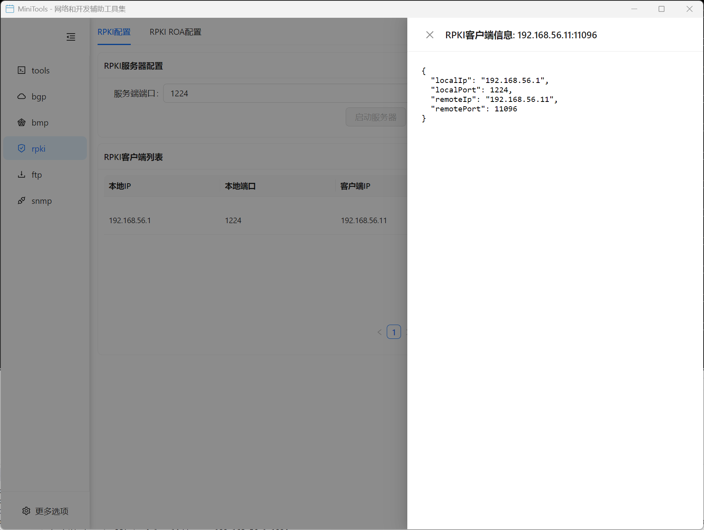

# RPKI 验证器

RPKI (Resource Public Key Infrastructure) 验证器是一个专业的路由源验证工具，用于验证 BGP 路由的合法性和安全性。

## 功能特性

### 核心功能
- 🔐 **路由源验证**: 验证 BGP 路由的合法性
- 📜 **ROA 管理**: 完整的 ROA (Route Origin Authorization) 记录管理
- 🌐 **实时验证**: 实时验证路由通告的有效性
- 📊 **验证报告**: 详细的验证结果和统计报告
- 🔄 **自动更新**: 支持 ROA 数据的自动更新和同步

### RPKI 配置和客户端
- RPKI 验证服务器配置
- Trust Anchor 配置
- 验证策略设置
- 客户端连接管理
- 缓存和同步设置

### ROA 记录管理
- ROA 记录的创建和编辑
- 路由前缀和 AS 号码配置
- Max Length 设置
- ROA 有效期管理
- 批量导入和导出功能

## 使用指南

### 基本配置步骤

1. **启动 RPKI 验证器**
   - 在主界面选择 "RPKI 验证器"
   - 进入 RPKI 配置界面

2. **配置 Trust Anchor**
   - 添加 Trust Anchor 证书
   - 设置验证策略
   - 配置同步参数

3. **管理 ROA 记录**
   - 添加或导入 ROA 记录
   - 设置路由前缀和 AS 号码
   - 配置 Max Length 参数

4. **执行路由验证**
   - 导入需要验证的路由
   - 执行验证过程
   - 查看验证结果

### 验证过程

#### 路由验证状态
- **Valid**: 路由有对应的有效 ROA 记录
- **Invalid**: 路由违反了 ROA 记录的规则
- **NotFound**: 没有找到对应的 ROA 记录

#### 验证规则
1. 检查路由前缀是否在 ROA 覆盖范围内
2. 验证 Origin AS 是否与 ROA 记录匹配
3. 检查前缀长度是否符合 Max Length 限制

### 高级功能

#### 批量验证
- 支持大量路由的批量验证
- 提供验证进度和结果统计
- 支持验证结果的过滤和排序

#### 验证报告
- 生成详细的验证报告
- 提供验证结果的统计分析
- 支持多种格式的报告导出

#### API 集成
- 提供 RESTful API 接口
- 支持第三方系统集成
- 实时验证服务

## 技术规范

### 支持的标准
- RFC 6480: An Infrastructure to Support Secure Internet Routing
- RFC 6481: A Profile for Resource Certificate Repository Structure
- RFC 6482: A Profile for Route Origin Authorizations (ROAs)
- RFC 6811: BGP Prefix Origin Validation
- RFC 8210: The Resource Public Key Infrastructure (RPKI) to Router Protocol

### 支持的协议
- RPKI-RTR Protocol
- HTTPS/HTTP for repository access
- rsync for repository synchronization

### 支持的证书格式
- X.509 certificates
- CRL (Certificate Revocation Lists)
- ROA objects
- Manifest objects

## 应用场景

### 网络安全
- 防止路由劫持攻击
- 验证路由通告的合法性
- 增强网络路由安全
- 合规性检查

### 网络运维
- 路由策略验证
- 网络配置审计
- 故障诊断和分析
- 安全监控

### 研究开发
- RPKI 协议研究
- 安全机制验证
- 性能测试和优化
- 新功能开发

## 部署建议

### 系统要求
- 充足的存储空间用于证书和 ROA 数据
- 稳定的网络连接用于数据同步
- 定期的数据备份和恢复机制

### 安全考虑
- 定期更新 Trust Anchor 证书
- 监控验证过程的异常情况
- 建立验证结果的审计机制
- 保护验证数据的完整性

## 常见问题

**Q: 如何添加新的 Trust Anchor？**
A: 在 RPKI 配置界面点击"添加 Trust Anchor"，导入证书文件并配置相关参数。

**Q: ROA 记录多久更新一次？**
A: 可以在配置中设置自动更新间隔，建议每小时或每天更新一次。

**Q: 验证结果为 Invalid 意味着什么？**
A: 表示该路由违反了 ROA 记录的规则，可能存在安全风险，需要进一步调查。

**Q: 如何处理大量的验证请求？**
A: 可以使用批量验证功能，或者通过 API 接口进行异步处理。
