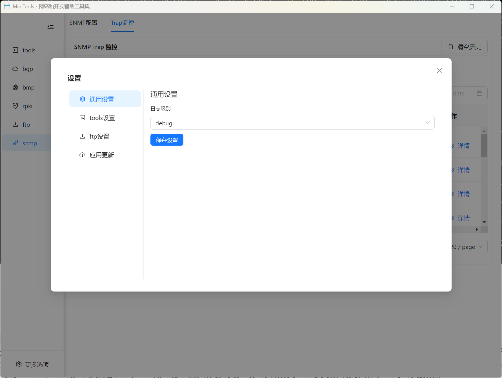
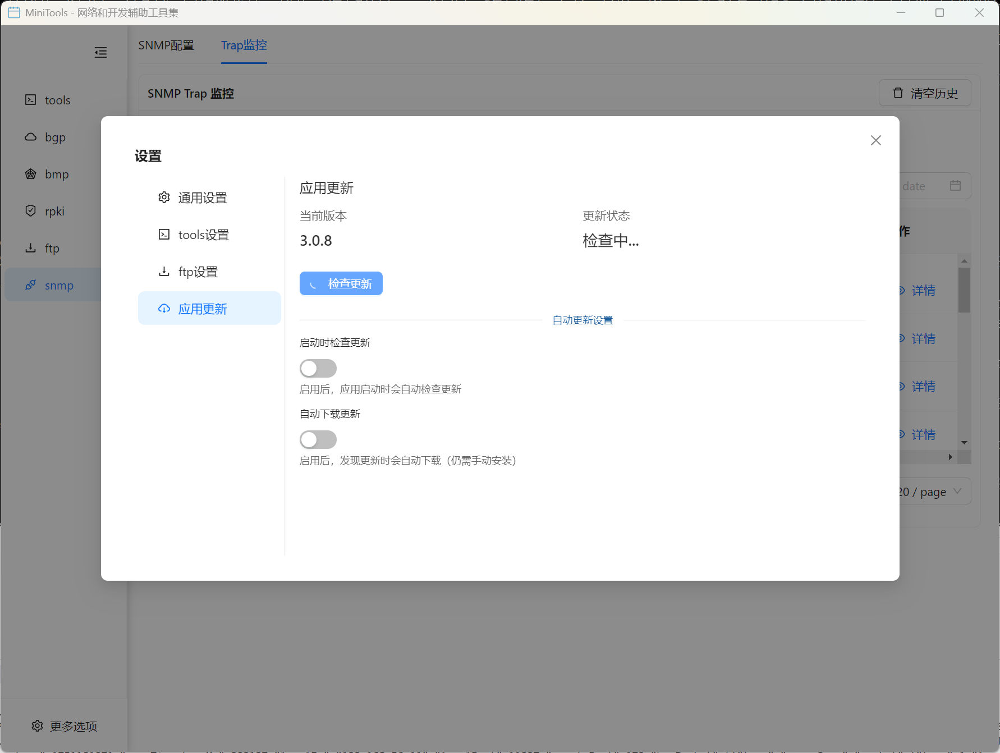

# 设置

NetNexus 提供丰富的设置选项,允许用户根据需求自定义应用行为和配置各种功能模块。

## 功能特性

### 设置分类
应用设置分为以下几个类别,每个类别管理特定功能模块的配置:

- **通用设置**: 应用全局配置,如日志级别
- **工具集合**: 工具模块的历史记录和存储配置
- **FTP服务器**: FTP 服务器相关配置
- **服务器部署**: Linux 服务器代理程序部署
- **Keychain**: TCP MD5 认证密钥管理
- **应用更新**: 自动更新和版本管理



## 设置详解

### 通用设置

#### 日志级别配置
控制应用的日志输出详细程度,帮助调试和问题排查。

**可选级别**:
- **debug**: 调试级别,输出最详细的日志信息
- **info**: 信息级别,输出一般运行信息
- **warn**: 警告级别,仅输出警告和错误信息
- **error**: 错误级别,仅输出错误信息

**使用建议**:
- 日常使用推荐 `info` 级别
- 遇到问题时可切换到 `debug` 级别以获取详细日志
- 生产环境建议使用 `warn` 或 `error` 级别

---

### 工具集合设置

管理各个工具模块的历史记录存储配置,控制历史数据的保留数量。

#### 字符串生成历史
- **配置项**: 字符串生成历史记录最大存储条数
- **范围**: 10 - 1000 条
- **默认值**: 100 条
- **说明**: 控制字符串生成器保存的历史记录数量

#### 报文解析历史
- **配置项**: 报文解析历史记录最大存储条数
- **范围**: 10 - 1000 条
- **默认值**: 100 条
- **说明**: 控制报文解析器保存的解析历史数量

#### 格式化工具历史
- **配置项**: 格式化历史记录最大存储条数
- **范围**: 10 - 1000 条
- **默认值**: 100 条
- **说明**: 控制格式化工具保存的格式化历史数量

**优化建议**:
- 如果磁盘空间充足,可以增大历史记录数量
- 如果需要节省空间,可以适当减小历史记录数量
- 历史记录过多可能影响加载速度

---

### FTP 服务器设置

#### FTP 用户管理
- **配置项**: FTP 用户最大存储条数
- **范围**: 10 - 1000 个
- **默认值**: 100 个
- **说明**: 控制 FTP 服务器可以创建的最大用户数量

---

### 服务器部署

Linux 服务器部署功能用于在远程 Linux 服务器上部署 TCP MD5 代理程序,支持需要 MD5 认证的协议功能。

#### 为什么需要部署？
某些协议功能(如 BMP 的 MD5 认证、RPKI 的 MD5 认证)需要在 Linux 服务器上部署代理程序。部署一次后,可供多个协议模块使用。

#### 部署配置
- **Linux 服务器地址**: 目标 Linux 服务器的 IP 地址
- **SSH 用户名**: SSH 登录用户名(通常为 root)
- **SSH 密码**: SSH 登录密码

#### 部署内容
部署过程会自动完成以下步骤:
1. 安装 gcc 编译器
2. 上传代理程序源码
3. 编译代理程序
4. 配置自动启动脚本
5. 配置防火墙规则

#### 数据流向
```
┌─────────────────────────┐
│      Router             │  路由器主动连接
│                         │
└────────┬────────────────┘
         │ TCP + MD5 签名
         ↓
┌─────────────────────────┐
│  Linux Server           │  验证 MD5 并转发
│                         │
│  tcp-md5-helper         │
└────────┬────────────────┘
         │ SSH 加密转发
         ↓
┌─────────────────────────┐
│  Windows App            │  接收并处理数据
│                         │
└─────────────────────────┘
```

**工作流程**:
1. BMP/RPKI 路由器连接到 Linux 服务器的指定端口(带 MD5 签名)
2. Linux 代理验证 MD5 签名,接受连接
3. 数据通过 SSH 转发加密传输到 Windows
4. Windows 应用接收并处理数据

**重要提示**:
- 只需部署一次,代理程序会一直运行在 Linux 服务器上
- 除非更换服务器或需要更新代理程序,否则不需要重新部署
- 部署前可以使用"测试连接"功能验证 SSH 连接

---

### Keychain 配置

Keychain 是 TCP MD5 认证密钥管理系统,用于管理 BGP、BMP、RPKI 等协议的 MD5 认证密钥。

#### 什么是 Keychain？
Keychain 是一种密钥链机制,用于管理 TCP MD5 认证密钥。每个 Keychain 可以包含多个密钥,支持密钥轮换和时间窗口控制。

#### Keychain 管理
- **创建 Keychain**: 为不同的对等体或协议创建独立的密钥链
- **编辑 Keychain**: 修改密钥链名称和描述
- **删除 Keychain**: 删除不再使用的密钥链

#### 密钥管理
每个 Keychain 可以包含多个密钥,每个密钥包含以下属性:

**基本属性**:
- **Key ID**: 密钥标识符 (0-255)
- **算法**: 加密算法,支持 MD5、HMAC-SHA-1、HMAC-SHA-256 等
- **密码**: 密钥字符串

**时间控制**:
- **发送时间段**: 控制密钥何时可用于发送数据
  - 始终发送: 密钥一直有效
  - 时间范围: 指定开始和结束时间
- **接受时间段**: 控制密钥何时可用于接收数据
  - 始终接受: 密钥一直有效
  - 时间范围: 指定开始和结束时间

**密钥操作**:
- **添加密钥**: 向 Keychain 添加新密钥
- **编辑密钥**: 修改密钥属性和时间窗口
- **删除密钥**: 删除不再使用的密钥

**使用场景**:
- BGP 对等体 MD5 认证
- BMP 服务器 MD5 认证
- RPKI 服务器 MD5 认证
- 密钥定期轮换
- 多密钥平滑切换

---

### 应用更新

应用更新设置允许用户配置自动更新行为,并手动检查和安装更新。



#### 版本信息
- **当前版本**: 显示当前安装的应用版本
- **更新状态**: 显示更新检查和下载状态

#### 手动更新操作
- **检查更新**: 手动检查是否有新版本可用
- **下载更新**: 发现新版本后下载更新包
- **重启并安装**: 下载完成后重启应用并安装更新

#### 自动更新设置

**启动时检查更新**:
- 启用后,应用启动时会自动检查更新
- 推荐开启,以便及时获取新功能和修复

**自动下载更新**:
- 启用后,发现更新时会自动下载(仍需手动安装)
- 可根据网络情况选择是否开启

**更新流程**:
1. 应用检查 GitHub Releases 获取最新版本
2. 如果有新版本,显示更新提示
3. 用户可选择立即下载或稍后下载
4. 下载完成后,用户可选择立即安装或稍后安装
5. 安装时应用会重启并应用更新

**注意事项**:
- 更新功能仅在生产环境(打包后的应用)中可用
- 开发环境中更新功能不可用
- 更新过程中请勿关闭应用
- 更新完成后会自动重启应用

## 使用指南

### 打开设置
1. 点击主界面左下角的"更多选项"按钮
2. 在下拉菜单中选择"设置"
3. 设置对话框会打开,显示所有设置分类

### 切换设置分类
- 在设置对话框左侧的菜单中点击不同的分类
- 右侧会显示对应分类的设置内容

### 保存设置
- 修改设置后,点击"保存设置"按钮
- 设置会立即生效并保存到本地
- 某些设置可能需要重启应用才能完全生效

## 常见问题

**Q: 修改日志级别后需要重启应用吗？**
A: 不需要,日志级别修改后会立即生效。

**Q: 历史记录数量设置为多少合适？**
A: 默认值 100 条对大多数用户已经足够。如果经常需要查看历史记录,可以增加到 200-500 条。

**Q: 服务器部署失败怎么办？**
A: 首先使用"测试连接"功能验证 SSH 连接是否正常。确保 Linux 服务器可以访问互联网(用于安装依赖)。

**Q: Keychain 中可以有多少个密钥？**
A: 每个 Keychain 可以包含任意数量的密钥,但建议不超过 10 个以便管理。

**Q: 如何禁用自动更新？**
A: 关闭"启动时检查更新"开关即可禁用自动更新检查。

**Q: 更新下载很慢怎么办？**
A: 更新文件托管在 GitHub,国内访问可能较慢。可以稍后重试或手动从 GitHub Releases 页面下载。

## 技术说明

### 配置存储
- 所有设置保存在本地配置文件中
- 使用 electron-store 进行配置管理
- 配置文件位于用户数据目录

### 服务器部署技术
- 使用 SSH2 库进行远程连接
- 自动化部署脚本基于 Shell 命令
- 代理程序使用 C 语言编写,支持 TCP MD5 签名

### 更新机制
- 基于 electron-updater 实现
- 使用 GitHub Releases 作为更新源
- 支持增量更新和完整更新
