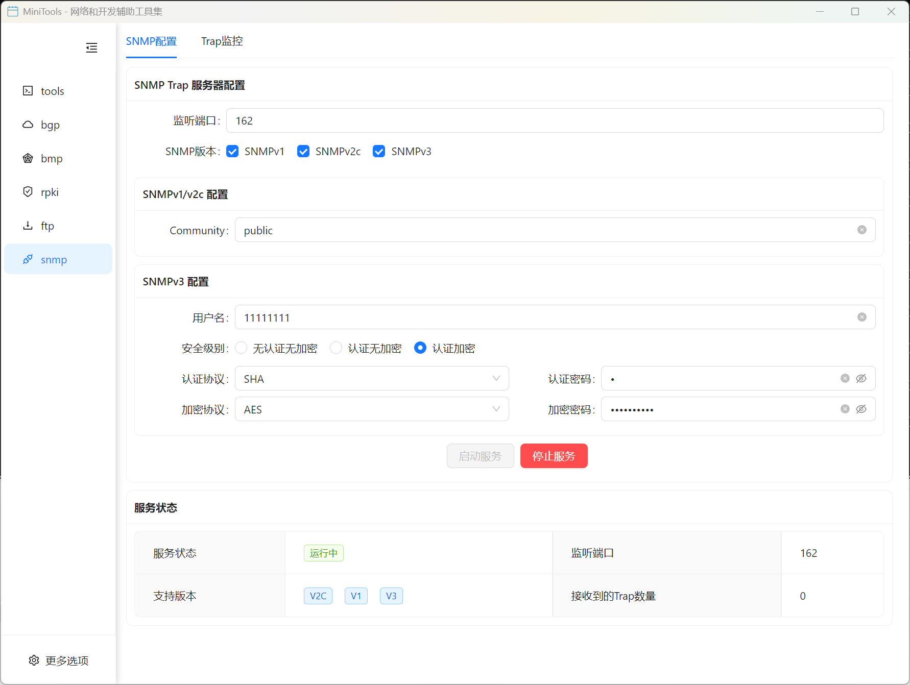
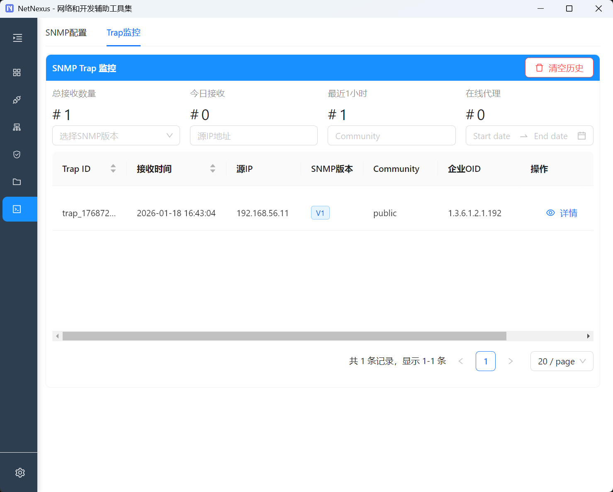
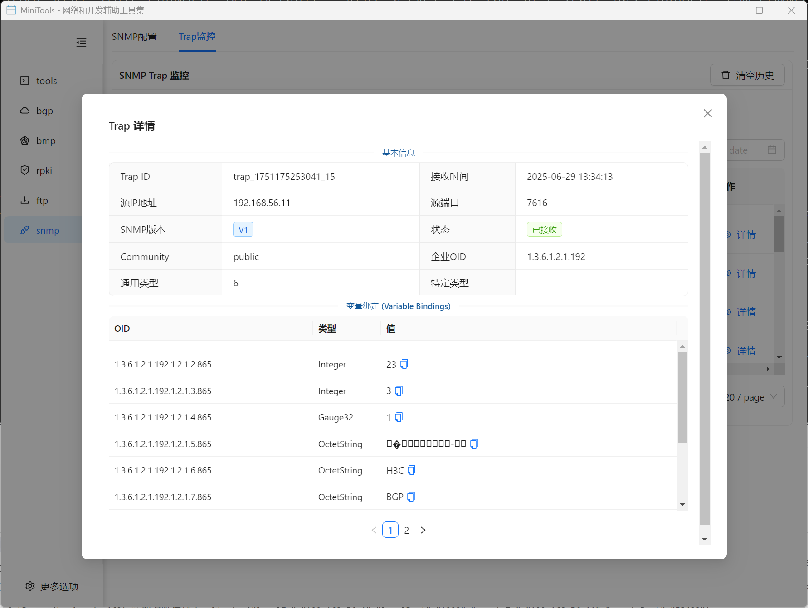

# SNMP 管理器

专业的 SNMP 网络管理工具，支持设备监控、数据收集和 Trap 消息处理。

## 功能特性

### 核心功能
- 🌐 **设备监控**: 支持 SNMP v1/v2c/v3 协议的设备监控
- 📊 **数据收集**: 自动收集和存储 SNMP 数据
- 🚨 **Trap 处理**: 实时接收和处理 SNMP Trap 消息
- 📈 **性能分析**: 提供设备性能趋势分析
- ⚙️ **灵活配置**: 支持多种 SNMP 配置和认证模式

### SNMP 配置
- SNMP 版本选择（v1/v2c/v3）
- Community 字符串配置
- 用户认证配置（USM）
- 目标设备管理
- OID 管理和 MIB 加载

### Trap 消息监控
- 实时 Trap 消息接收
- Trap 消息解析和显示
- 告警级别分类
- 消息过滤和搜索
- 历史 Trap 记录

### Trap 详细信息
- Trap 消息的详细字段信息
- OID 值解析和描述
- 时间戳和源设备信息
- 变量绑定详细显示
- Trap 类型和严重级别

## 使用指南

### 基本配置

1. **SNMP 版本配置**
   - 选择合适的 SNMP 版本
   - 配置相应的认证参数
   - 设置超时和重试参数

2. **设备管理**
   - 添加目标设备
   - 配置设备连接参数
   - 验证设备连通性
   - 设置轮询间隔

3. **MIB 管理**
   - 加载标准 MIB 文件
   - 导入私有 MIB
   - OID 浏览器使用
   - MIB 编译和验证

### SNMP v1/v2c 配置

1. **Community 设置**
   - 配置读 Community
   - 配置写 Community
   - 设置访问权限
   - 安全注意事项

2. **基本操作**
   - GET 操作：获取单个 OID 值
   - GET-NEXT 操作：遍历 MIB 树
   - GET-BULK 操作：批量获取数据
   - SET 操作：设置设备参数

### SNMP v3 配置

1. **用户配置**
   - 创建 SNMP v3 用户
   - 配置安全级别
   - 设置认证协议
   - 配置加密协议

2. **安全级别**
   - noAuthNoPriv：无认证无加密
   - authNoPriv：认证无加密
   - authPriv：认证加密

3. **认证和加密**
   - MD5/SHA 认证协议
   - DES/AES 加密协议
   - 密钥管理
   - 安全最佳实践

### Trap 监控配置

1. **Trap 接收器设置**
   - 配置监听地址和端口
   - 设置 Community 字符串
   - 配置 v3 用户参数
   - 启用 Trap 服务

2. **Trap 处理**
   - Trap 消息过滤
   - 告警规则设置
   - 通知机制配置
   - 日志记录设置

## 技术规范

### 支持的 SNMP 版本
- SNMP v1 (RFC 1157)
- SNMP v2c (RFC 1901-1908)
- SNMP v3 (RFC 3410-3418)

### 支持的操作
- GET：获取单个 OID 的值
- GET-NEXT：获取下一个 OID 的值
- GET-BULK：批量获取多个 OID 的值
- SET：设置 OID 的值
- TRAP：接收异步通知消息

### 支持的数据类型
- INTEGER
- OCTET STRING
- OBJECT IDENTIFIER
- NULL
- Counter32/Counter64
- Gauge32
- TimeTicks
- IpAddress

### 安全特性
- Community-based Security (v1/v2c)
- User-based Security Model (v3)
- Authentication Protocols (MD5, SHA)
- Privacy Protocols (DES, AES)

## 高级功能

### 批量操作
- 批量设备发现
- 批量数据收集
- 批量配置下发
- 批量监控设置

### 数据分析
- 历史数据查询
- 性能趋势分析
- 统计报告生成
- 数据导出功能

### 告警管理
- 告警规则定义
- 告警级别设置
- 告警通知机制
- 告警历史记录

### 自动化功能
- 定时任务调度
- 脚本执行支持
- API 接口提供
- 第三方集成

## 应用场景

### 网络监控
- 设备状态监控
- 接口流量监控
- 系统资源监控
- 网络拓扑发现

### 故障管理
- 实时告警处理
- 故障根因分析
- 自动故障恢复
- 维护计划管理

### 性能管理
- 性能数据收集
- 趋势分析报告
- 容量规划支持
- 性能优化建议

### 配置管理
- 设备配置备份
- 配置变更跟踪
- 批量配置部署
- 合规性检查

## 监控指标

### 系统监控
- CPU 使用率
- 内存使用率
- 磁盘空间使用
- 系统负载

### 网络监控
- 接口状态
- 流量统计
- 错误包统计
- 带宽利用率

### 应用监控
- 服务状态
- 响应时间
- 并发连接数
- 应用性能指标

## 常见问题

**Q: SNMP v3 认证失败怎么办？**
A: 检查用户名、认证协议、密码设置，确保与设备配置一致。

**Q: 如何添加自定义 MIB？**
A: 在 MIB 管理界面导入 MIB 文件，系统会自动编译和加载。

**Q: Trap 消息接收不到怎么办？**
A: 检查网络连通性、防火墙设置、Community 配置等。

**Q: 如何设置告警规则？**
A: 在告警管理界面定义告警条件、阈值和通知方式。

**Q: 支持哪些设备类型？**
A: 支持所有符合 SNMP 标准的网络设备，包括路由器、交换机、服务器等。
