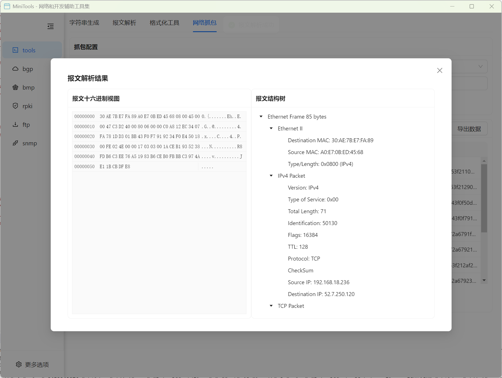

# 工具集合

集成了多种实用的开发和网络工具，为用户提供一站式的工具解决方案。

## 功能特性

### 格式化工具
强大的数据格式化和美化工具，支持多种数据格式的解析和格式化。

#### 支持的格式
- JSON 格式化和验证
- XML 格式化和验证
- YAML 格式化和验证
- SQL 格式化和美化
- HTML/CSS 格式化
- JavaScript 代码格式化

### 报文解析器
专业的网络报文解析工具，支持多种网络协议的报文分析和解析。

#### 支持的协议
- Ethernet 帧解析
- IP 报文解析 (IPv4/IPv6)
- TCP/UDP 报文解析
- ARP 报文解析
- BGP 报文解析
- ICMP 报文解析

### 报文捕获工具
网络报文捕获和分析工具，提供实时的网络流量监控和分析功能。

#### 核心功能
- 实时报文捕获
- 多网卡支持
- 过滤规则设置
- 报文统计分析
- 捕获数据导出

### 报文捕获解析器
将捕获的报文数据进行深度解析，提供详细的协议分析结果。

#### 分析功能
- 协议栈分析
- 数据流重组
- 统计信息生成
- 异常检测
- 性能分析

### 端口监控器
实时监控系统端口和网络连接状态,提供进程级别的网络连接管理功能。

#### 核心功能
- 实时端口监听状态查看
- TCP/UDP 连接监控
- 进程与端口关联显示
- 连接状态过滤和搜索
- 进程终止功能
- 自动刷新机制

#### 监控信息
- 协议类型 (TCP/UDP)
- 本地地址和端口
- 远程地址和端口
- 连接状态 (LISTENING/ESTABLISHED 等)
- 进程 ID (PID)
- 进程名称

### 网络信息
网络接口管理工具,提供网络接口信息查看和 IP 地址配置管理功能。

#### 核心功能
- 网络接口信息查看
- IPv4/IPv6 地址管理
- IP 地址添加、修改、删除
- MAC 地址显示
- 接口状态监控
- 网络流量统计图表

#### 管理功能
- IPv4 地址修改 (不支持删除)
- IPv6 地址添加、修改、删除
- 子网掩码/前缀长度配置
- 默认网关设置
- 实时流量统计可视化

### 字符串生成器
灵活的字符串生成工具，支持多种模式和自定义规则的字符串生成。

#### 生成模式
- 随机字符串生成
- 基于模式的生成
- 正则表达式生成
- 序列号生成
- UUID/GUID 生成
- 密码生成

### 历史记录保存
所有工具都支持操作历史记录的保存和管理功能。

#### 历史功能
- 操作历史记录
- 结果保存和恢复
- 历史搜索和过滤
- 批量操作管理
- 数据导出功能

## 使用指南

### 格式化工具使用

1. **选择格式类型**
   - 从格式类型下拉菜单中选择需要格式化的数据类型
   - 支持自动格式检测

2. **输入数据**
   - 在输入框中粘贴或输入需要格式化的数据
   - 支持文件导入功能

3. **执行格式化**
   - 点击格式化按钮执行操作
   - 查看格式化结果和错误信息

4. **结果处理**
   - 复制格式化结果
   - 保存到文件
   - 添加到历史记录

### 报文解析器使用

1. **输入报文数据**
   - 支持十六进制字符串输入
   - 支持二进制文件导入
   - 支持从捕获工具导入

2. **选择解析类型**
   - 自动协议检测
   - 手动指定协议类型
   - 自定义解析规则

3. **查看解析结果**
   - 层次化协议结构显示
   - 详细字段信息展示
   - 原始数据对照显示

### 报文捕获使用

1. **选择网络接口**
   - 列出所有可用网络接口
   - 显示接口状态和统计信息

2. **设置捕获参数**
   - 配置过滤规则
   - 设置捕获数量限制
   - 选择捕获模式

3. **开始捕获**
   - 启动捕获进程
   - 实时显示捕获统计
   - 监控捕获状态

4. **分析和导出**
   - 查看捕获的报文
   - 进行协议分析
   - 导出捕获数据

### 端口监控使用

1. **查看端口连接**
   - 自动加载系统所有端口连接
   - 查看 TCP/UDP 连接详情
   - 按协议、状态筛选

2. **搜索和过滤**
   - 支持按端口号搜索
   - 支持按进程名搜索
   - 支持按 PID 搜索
   - 支持按地址搜索

3. **自动刷新设置**
   - 启用/禁用自动刷新
   - 设置刷新间隔 (3/5/10/30 秒)
   - 手动刷新功能

4. **进程管理**
   - 查看进程与端口关联
   - 关闭占用端口的进程
   - 关键进程保护提示

### 网络信息使用

1. **查看网络接口**
   - 选择网络接口
   - 查看接口状态 (UP/DOWN)
   - 查看 MAC 地址
   - 查看所有 IP 地址

2. **管理 IPv4 地址**
   - 修改 IPv4 地址
   - 修改子网掩码
   - 设置默认网关
   - 注意: 不支持删除 IPv4 地址

3. **管理 IPv6 地址**
   - 添加新的 IPv6 地址
   - 修改现有 IPv6 地址
   - 删除 IPv6 地址
   - 设置前缀长度和网关

4. **流量统计**
   - 查看实时流量图表
   - 监控上传/下载速率
   - 历史流量趋势分析

### 字符串生成器使用

1. **选择生成模式**
   - 从预定义模式中选择
   - 自定义生成规则
   - 配置生成参数

2. **设置生成选项**
   - 指定生成数量
   - 设置字符集范围
   - 配置格式要求

3. **生成和使用**
   - 执行生成操作
   - 预览生成结果
   - 复制或导出结果

## 技术特性

### 性能优化
- 多线程处理支持
- 大文件处理优化
- 内存使用优化
- 响应速度优化

### 用户体验
- 直观的用户界面
- 实时操作反馈
- 错误信息提示
- 操作历史记录

### 扩展性
- 插件式架构
- 自定义规则支持
- API 接口提供
- 第三方集成

## 应用场景

### 开发调试
- 数据格式验证
- 网络通信调试
- 协议分析测试
- 性能监控分析

### 网络运维
- 网络故障诊断
- 流量分析监控
- 安全事件调查
- 性能优化分析

### 学习研究
- 网络协议学习
- 数据格式理解
- 工具使用实践
- 技术验证测试

### 日常工作
- 数据处理转换
- 字符串批量生成
- 文本格式化美化
- 开发辅助工具

## 常见问题

**Q: 格式化工具支持哪些数据格式？**
A: 支持 JSON、XML、YAML、SQL、HTML/CSS、JavaScript 等常见格式。

**Q: 报文解析器如何处理未知协议？**
A: 提供原始数据的十六进制显示，支持自定义解析规则添加。

**Q: 捕获的报文数据如何保存？**
A: 支持多种格式保存，包括 pcap、txt、json 等格式。

**Q: 字符串生成器能否生成复杂的模式？**
A: 支持正则表达式和自定义规则，可以生成复杂的字符串模式。

**Q: 工具的历史记录保存在哪里？**
A: 历史记录保存在本地数据库中，支持导出和备份功能。

**Q: 端口监控器如何关闭进程？**
A: 在端口列表中找到对应进程，点击"关闭"按钮。系统会对关键进程进行保护提示。

**Q: 网络信息工具支持哪些操作？**
A: 支持查看网络接口信息、修改 IPv4 地址、添加/修改/删除 IPv6 地址、查看流量统计等。

**Q: 为什么不能删除 IPv4 地址？**
A: 为了保证网络连接稳定性，系统限制了 IPv4 地址的删除操作，但支持修改。IPv6 地址可以自由添加和删除。
